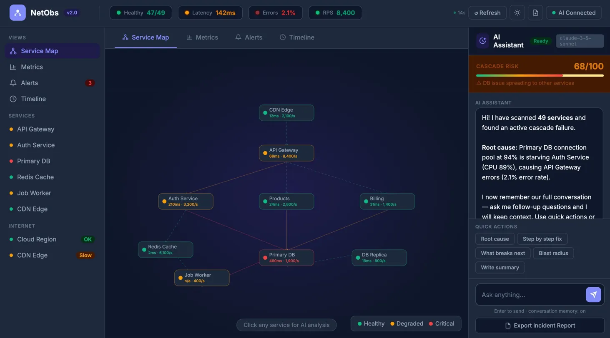

# NetObs — AI-Powered Network Observability
 
> Stop alerting. Start explaining.
 
NetObs is a browser-based AI network observability dashboard powered by the Claude API. When something breaks, it tells you **why**, what the **blast radius** is, and exactly **how to fix it** — in plain English.
 
No agents. No infrastructure. No $100k contract.
 
   
 
> ⚠️ Work in progress — core features are live and working. Real data connectors, postmortem generator, and mobile layout are actively being built.
 
---
 
## Live Demo
 
**[→ Open NetObs](https://jhaveribhavishi.github.io/netobs/netobs.html)**
 
> Requires a free [Anthropic API key](https://console.anthropic.com). Typical cost per session: under $0.05.
 
---
 
## Screenshots
 
### Light Mode — Service Map

 
### Dark Mode

 
### AI Root Cause Analysis

 
---
 
## The Problem
 
Every monitoring tool tells you **that** something broke. None tell you **why** — fast enough.
 
The average engineer context-switches across 4+ dashboards during an incident. Mean time to root cause averages 45 minutes industry-wide. Meanwhile your users are feeling it.
 
NetObs puts an AI that thinks like a senior SRE directly in your incident workflow.
 
---
 
## What It Does
 
| Feature | Description |
|---|---|
| **Service Map** | Live topology with color-coded health. Click any node for instant AI analysis. |
| **Metrics Dashboard** | Latency, error rate, throughput, P99 — 6-hour history with anomaly markers. |
| **Predictive Risk Scores** | Per-service AI risk scores. Know what breaks before it does. |
| **Alert Panel** | Severity-ranked alerts with AI root cause tags pre-attached. |
| **AI Assistant** | Conversational Claude-powered interface with full conversation memory. |
| **Incident Timeline** | Auto-logged audit trail of every action, AI response, and alert. |
| **Export Report** | One-click Markdown incident report with full AI conversation log. |
| **Slack Integration** | Send alerts to Slack with AI root cause pre-attached. |
| **Prometheus Connector** | Pull live metrics directly from your Prometheus instance. |
| **Dark Mode** | Full dark/light mode with localStorage persistence. |
| **🆕 Health Check Polling** | Add any /health endpoint — NetObs pings it every 30s and alerts on failure. |
| **🆕 Alert Sounds** | Audio ping on critical alerts. Toggle on/off with the 🔔 button. |
| **🆕 Animated Traffic Flow** | Live dots travel along service connections showing real-time traffic. |
| **🆕 Node Sparklines** | Hover any service node to see a 60-minute latency sparkline chart. |
 
### Ask the AI things like:
- *"What is the root cause and how do I fix it?"*
- *"What breaks next if we do nothing?"*
- *"Give me the exact SQL fix."*
- *"What is the blast radius if the database goes down?"*
- *"Write an incident summary for my team."*
---
 
## Quickstart
 
### Use the live demo
Open **[NetObs](https://jhaveribhavishi.github.io/netobs/netobs.html)** — paste your API key — done.
 
### Run locally
 
```bash
git clone https://github.com/jhaveribhavishi/netobs.git
cd netobs
python -m http.server 8000
open http://localhost:8000/netobs.html
```
 
> You must serve via a local server — browsers block API calls from `file://` URLs.
 
### Get an API key
1. Go to [console.anthropic.com](https://console.anthropic.com)
2. Sign up → **API Keys** → **Create Key**
3. Add billing (minimum $5 — lasts hundreds of sessions)
4. Paste the key into the modal when the app opens
---
 
## New in v3.0
 
### 1. Health Check Endpoint Polling
Add any `/health` URL in the Metrics tab. NetObs polls it every 30 seconds, shows live response time and status, and fires an alert + sound if it goes down. All monitored endpoints appear in the sidebar.
 
```
Metrics tab → Health Check Endpoints → paste URL → Add
```
 
### 2. Alert Sounds
Subtle audio ping when critical alerts fire — so you know something is wrong without staring at the screen. Three tones by severity: critical (double beep), warning (single), info (soft). Toggle with the 🔔 button in the header.
 
### 3. Animated Traffic Flow
Colored dots travel along the connection lines between services in real time. Speed reflects traffic volume, color reflects health — red on critical paths, amber on degraded, green on healthy. Makes the topology feel alive and helps spot cascading failures visually.
 
### 4. Node Sparklines on Hover
Hover over any service node in the Service Map to see a mini latency chart for the last 60 minutes. Instantly shows whether latency is trending up, stable, or recovering — without clicking into a separate metrics view.
 
---
 
## Architecture
 
```
Browser
   │
   │  POST request
   ▼
Cloudflare Worker  (CORS proxy)
netobs-proxy.bhavishij.workers.dev
   │
   │  POST + auth headers
   ▼
Anthropic Claude API
api.anthropic.com
```
 
Direct browser-to-Anthropic calls are blocked by CORS on hosted URLs. The Cloudflare Worker acts as a lightweight proxy. Runs on Cloudflare free tier — 100,000 requests per day.
 
---
 
## Deploy Your Own
 
**Step 1 — Fork this repo and enable GitHub Pages**
 
Settings → Pages → Branch: main → / (root) → Save
 
**Step 2 — Create a Cloudflare Worker**
 
1. Go to [cloudflare.com](https://cloudflare.com) → sign up free
2. Compute → Workers → Create Worker → name it `netobs-proxy`
3. Paste the contents of `worker.js` → Deploy
**Step 3 — Update the proxy URL in netobs.html**
 
Find this line:
```javascript
fetch('https://netobs-proxy.bhavishij.workers.dev', {
```
 
Replace `bhavishij` with your Cloudflare username.
 
**Step 4 — Push and you are live**
 
---
 
## Connecting Real Data
 
All demo data is marked with `// DEMO DATA` comments. Replace these sections for real telemetry:
 
| Section | Replace with | Source |
|---|---|---|
| `NODES` object | Live service health | Prometheus / Kubernetes API |
| `EDGES` array | Real dependency map | Service mesh / Consul |
| `ALERTS` array | Live firing alerts | Alertmanager / PagerDuty |
| Chart data | Real time-series | Prometheus `/api/v1/query_range` |
| Health endpoints | Real /health URLs | Your own services |
 
### Example: Fetch from Prometheus
 
```javascript
async function loadLiveData() {
  const res = await fetch('http://your-prometheus:9090/api/v1/query?query=up');
  const data = await res.json();
  data.data.result.forEach(r => {
    const id = r.metric.job;
    if (NODES[id]) {
      NODES[id].status = r.value[1] === '1' ? 'ok' : 'crit';
    }
  });
  drawTopo();
}
```
 
---
 
## Tech Stack
 
| Layer | Technology |
|---|---|
| Frontend | Vanilla HTML, CSS, JavaScript — no framework, no build step |
| AI | Anthropic Claude API (`claude-3-5-sonnet-20241022`) |
| Proxy | Cloudflare Workers (free tier) |
| Charts | Chart.js 4.4.1 (CDN) |
| Audio | Web Audio API (built-in browser) |
| Hosting | GitHub Pages (free) |
 
---
 
## Why This Exists
 
Enterprise observability tools (Datadog, Dynatrace) cost $50k–$500k/year, require weeks of setup, and still give you dashboards — not answers. Open source stacks give you flexibility but no causality.
 
NetObs is the missing middle — a zero-infrastructure AI layer on top of whatever monitoring you already have. It does not replace your existing tools. It explains them.
 
**Market reality:**
- Only 4% of organizations have reached full AI operational maturity in observability
- 38% of teams report alert fatigue as their top challenge
- Mean time to root cause averages 45 minutes industry-wide
---
 
## Roadmap
 
- [ ] Prometheus connector (UI-based, no code needed)
- [ ] Datadog API integration
- [ ] AWS CloudWatch connector
- [ ] OpenTelemetry trace ingestion
- [ ] Auto-triggered AI analysis on new critical alerts
- [ ] Postmortem generator
- [ ] Export to PDF
- [ ] Mobile responsive layout
- [ ] Multi-environment switcher (prod / staging / dev)
- [ ] Cost impact calculator
---
 
## Changelog
 
See [CHANGELOG.md](CHANGELOG.md) for full version history.
 
---
 
## File Structure
 
```
netobs/
├── netobs.html       ← entire frontend (single file)
├── worker.js         ← Cloudflare Worker proxy
├── data.json         ← sample data structure
├── CHANGELOG.md      ← version history
├── LICENSE           ← MIT
├── dashboard.png     ← screenshot light mode
├── darkmode.png      ← screenshot dark mode
├── AI Analysis.png   ← screenshot AI panel
└── README.md         ← this file
```
 
---
 
## Contributing
 
PRs welcome. The highest value contributions are **data source connectors** — Prometheus, Datadog, CloudWatch. If you build one, please share it back.
 
1. Fork the repo
2. Create a branch: `git checkout -b feature/prometheus-connector`
3. Open a Pull Request
---
 
## License
 
MIT — use it, fork it, build on it. See [LICENSE](LICENSE).
 
---
## Author

Built by Bhavishi Jhaveri — technical customer engineer and cloud infrastructure architect with 8+ years helping enterprise customers design, automate, and operate hybrid cloud environments. Experience spans solution architecture, network automation (Ansible, Python, Nautobot), Palo Alto/Panorama security design, and cloud migration strategy. Passionate about translating complex infrastructure into products customers can actually use.

[GitHub](https://github.com/jhaveribhavishi) · [LinkedIn](https://www.linkedin.com/in/bhavishi-jhaveri)

---

*If this helped you, give it a ⭐*
